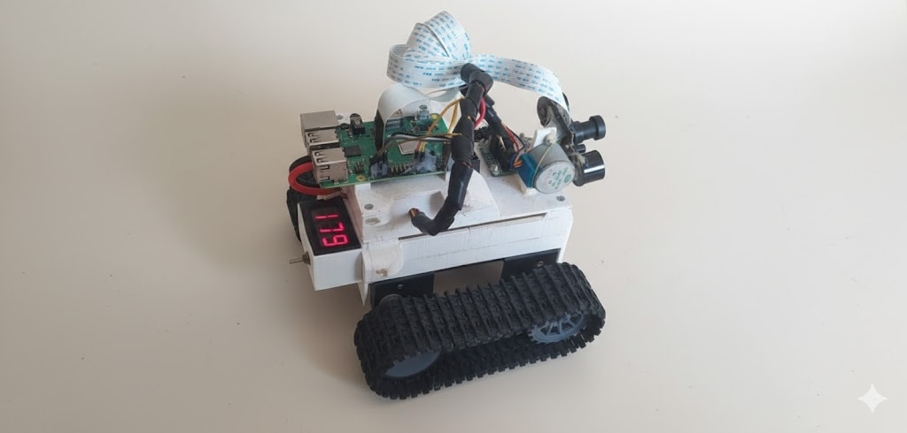

# RobotChenilles 

Un système de contrôle de robot à chenilles basé sur Raspberry Pi avec interface web en temps réel.



## Description

RobotChenilles est un projet de robot télécommandé composé de :
- Un backend Flask Python qui contrôle les moteurs, la caméra et les capteurs via GPIO
- Un frontend React pour le contrôle à distance via navigateur web
- Streaming vidéo en temps réel avec contrôle de l'orientation de la caméra
- Monitoring de température via capteur DS18B20

## Architecture

```
RobotChenilles/
├── backend/          # API Flask pour contrôle hardware
│   ├── main.py       # Serveur API principal
│   ├── motors.py     # Contrôle des moteurs
│   ├── camera.py     # Streaming caméra + servo
│   ├── temperature.py # Lecture capteur température
│   └── ...
└── frontend/         # Interface web React
    ├── src/
    │   ├── components/ # Composants UI
    │   └── ...
    └── ...
```

## Prérequis

### Hardware
- Raspberry Pi (testé sur Pi 3/4)
- 2 moteurs DC pour les chenilles
- Caméra Pi (compatible picamera2)
- Moteur pas-à-pas pour l'orientation caméra
- Capteur de température DS18B20 (1-Wire)
- Circuit de puissance pour moteurs (pont H)

### Software
- Raspberry Pi OS
- Python 3.7+
- Node.js 16+
- Docker (optionnel, pour déploiement)

## Installation

### Backend (sur Raspberry Pi)

1. **Cloner le projet**
```bash
git clone <repository-url>
cd RobotChenilles/backend
```

2. **Installer les dépendances Python**
```bash
bash install-deps.sh
```

3. **Configurer le service systemd** (optionnel)
```bash
# Éditer les chemins dans robot-backend.service si nécessaire
sudo cp robot-backend.service /etc/systemd/system/
sudo systemctl daemon-reload
sudo systemctl enable robot-backend.service
sudo systemctl start robot-backend.service
```

### Frontend

1. **Installer les dépendances Node.js**
```bash
cd frontend
npm install
```

2. **Configuration réseau**
   - Modifier l'IP du backend dans `src/components/Command.js` et `src/components/Camera.js`
   - Par défaut configuré pour `192.168.1.127:5000`

## Utilisation

### Démarrage en développement

**Backend :**
```bash
cd backend
python3 main.py
```

**Frontend :**
```bash
cd frontend
npm start
```

### Contrôles
- **Flèches directionnelles** : Déplacement du robot (avant/arrière/gauche/droite)
- **Touche A** : Lever la caméra
- **Touche Q** : Baisser la caméra
- **Streaming vidéo** : Automatique dans l'interface
- **Température** : Affichage en temps réel

### Déploiement avec Docker

```bash
cd frontend
bash build.sh
docker stack deploy -c docker-compose.yml myrobot
```

## 🔧 Configuration Hardware

### Brochage GPIO

| Composant | GPIO (BCM) | Description |
|-----------|------------|-------------|
| Moteur gauche | 13, 26 | Avant, Arrière |
| Moteur droit | 16, 12 | Avant, Arrière |
| Moteur pas-à-pas | 14, 15, 18, 23 | Phases A, B, C, D |
| Capteur température | 1-Wire | Device: 28-00000a29354b |

### Schéma de connexion
```
Raspberry Pi
├── GPIO 13/26 → Pont H → Moteur Gauche
├── GPIO 16/12 → Pont H → Moteur Droit  
├── GPIO 14-23 → Driver → Moteur pas-à-pas
└── 1-Wire → Capteur DS18B20
```

## API Endpoints

| Endpoint | Méthode | Description |
|----------|---------|-------------|
| `/video` | GET | Stream vidéo MJPEG |
| `/move/<direction>` | POST | Contrôle moteurs (forward/backward/left/right/stop) |
| `/cam_up` | GET | Lever la caméra |
| `/cam_down` | GET | Baisser la caméra |
| `/temperature` | GET | Lecture température |

## Dépannage

### Problèmes courants

**Le robot ne bouge pas**
- Vérifier les connexions GPIO
- Tester l'alimentation des moteurs
- Vérifier les permissions GPIO (`sudo usermod -a -G gpio $USER`)

**Pas de vidéo**
- Activer la caméra : `sudo raspi-config` → Interface Options → Camera
- Vérifier que picamera2 est installé

**Capteur température non détecté**
- Activer 1-Wire : ajouter `dtoverlay=w1-gpio` dans `/boot/config.txt`
- Redémarrer et vérifier `/sys/bus/w1/devices/`

### Logs
```bash
# Logs du service
sudo journalctl -u robot-backend.service -f

# Test manuel du capteur
bash backend/read_temp.sh
```

## Développement

### Structure du code
- **Backend modulaire** : Séparation motors/camera/temperature
- **Frontend React** : Composants réutilisables
- **Communication HTTP** : API REST simple
- **Streaming temps réel** : MJPEG over HTTP

### Tests
```bash
# Tests frontend
cd frontend && npm test

# Test backend (manuel)
cd backend && python3 -c "from motors import forward; forward()"
```
