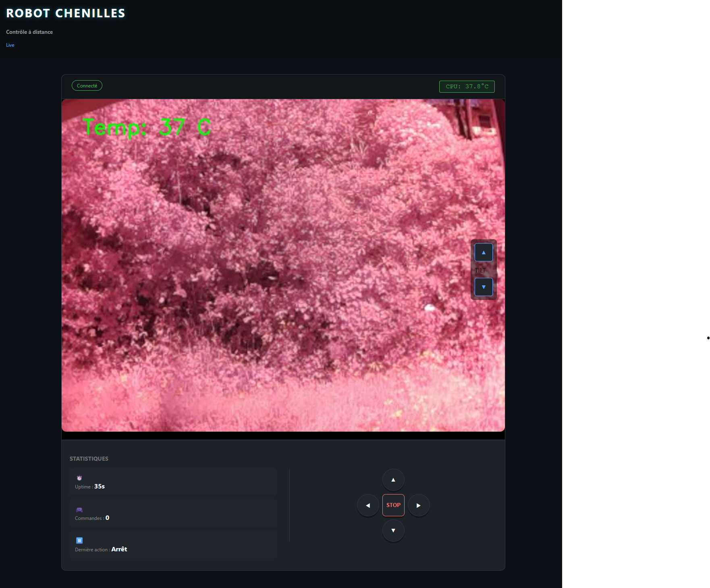
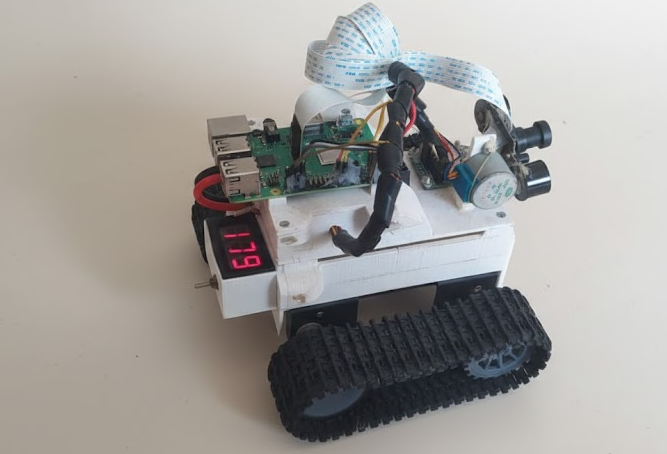

# Robot Chenilles





# ROS 2 & Pi 5: Compilation & Execution Guide
This guide summarizes the essential commands for managing your C++ nodes and Launch files on the Raspberry Pi 5

## Setup the Environment

Note: Run this in every new terminal window, or add it to your ~/.bashrc.Bash

```bash
# Load ROS 2 Humble/Jazzy system commands
source /opt/ros/humble/setup.bash
```

```bash
# Load your specific robot workspace (after building)
source ~/RobotChenilles/ros2_ws/install/setup.bash
```

---

## 🏗️ 1. Compilation (Le Workflow Pro)
*À exécuter depuis la racine du dossier `ros2_ws/`.*

| Commande | Usage |
| :--- | :--- |
| `colcon build` | Compile tout le projet (lent la première fois). |
| `colcon build --packages-select <nom>` | Compile **uniquement** le package spécifié (gain de temps). |
| `colcon build --symlink-install` | **Indispensable :** Lie les fichiers Python/Launch. Pas besoin de recompiler après un changement de script ! |
| `colcon build --parallel-workers 4` | Utilise les 4 cœurs du Pi 5 pour compiler plus vite. |
| `rm -rf build/ install/ log/` | Nettoie tout pour une compilation "propre". |

> **Le combo ultime pour le Pi 5 :**
> `colcon build --symlink-install --parallel-workers 4`

---

## 🔌 2. Environnement (Le "Source")
*Indispensable pour que Linux trouve tes commandes ROS.*

| Commande | Quand l'utiliser ? |
| :--- | :--- |
| `source /opt/ros/humble/setup.bash` | Au démarrage de chaque terminal (Système). |
| `source install/setup.bash` | Après chaque compilation réussie (Ton code). |

---

## 🚀 3. Exécution
| Commande | Action |
| :--- | :--- |
| `ros2 launch robot_bringup robot.launch.py` | Démarre tout le robot (Hardware + Brain + Web). |
| `ros2 run robot_hardware motor_node` | Teste uniquement les moteurs en direct. |
| `ros2 run robot_hardware temp_node` | Teste uniquement le capteur de température. |

---

## 🔍 4. Debug & Introspection (Voir ce qui se passe)
| Commande | Action |
| :--- | :--- |
| `ros2 node list` | Affiche tous les nodes actifs (le "cerveau" actuel). |
| `ros2 topic list` | Affiche tous les flux de données (`/cmd_vel`, `/temp`, etc.). |
| `ros2 topic echo /temp` | Affiche en direct les valeurs du capteur de température. |
| `ros2 topic hz /cmd_vel` | Vérifie la fréquence de réception des ordres moteurs. |
| `ros2 topic pub /cmd_vel geometry_msgs/msg/Twist "{...}"` | Envoie une commande manuelle aux moteurs. |

---

## 💡 Astuce .bashrc (Automatisation)
Pour éviter de taper les `source` à chaque fois, ajoute-les à la fin de ton fichier `~/.bashrc` sur ton Pi 5 :

```bash
echo "source /opt/ros/humble/setup.bash" >> ~/.bashrc
echo "source ~/RobotChenilles/ros2_ws/install/setup.bash" >> ~/.bashrc
```

# Launch

```bash
source install/setup.bash
ros2 launch robot_bringup robot.launch.py
```

# Video tuto

Concept of Workspaces and Packages in ROS 2 : https://www.youtube.com/watch?v=b6Gb8eCAoQg