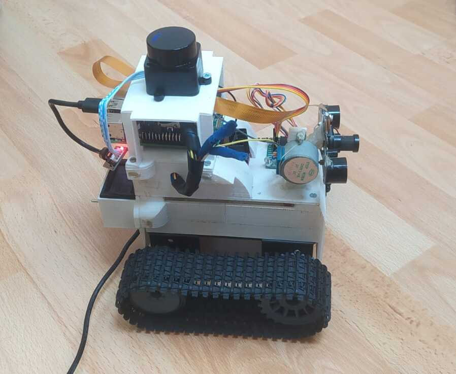
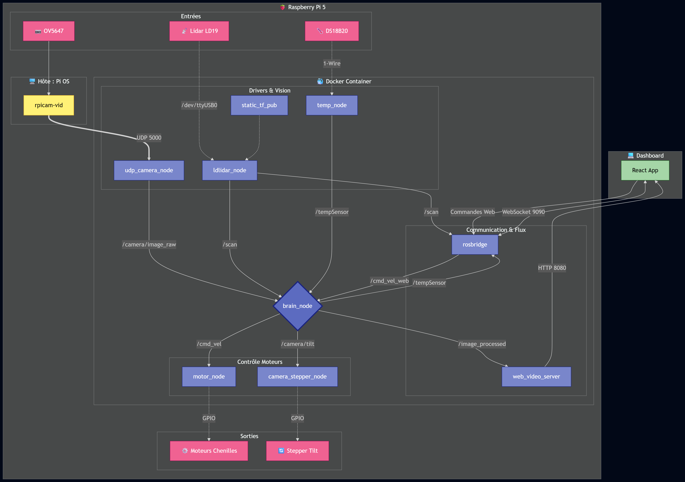

# Robot Chenilles - Exploration Terrestre


Ce projet présente un robot d'exploration terrestre autonome et téléopéré. Le système repose sur ROS 2 Jazzy et une Raspberry Pi 5, offrant une architecture modulaire et performante.




# Interface de Contrôle (Frontend)
L'interface utilisateur est développée en React. Elle permet de :

* **Visualiser le flux vidéo** en temps réel avec incrustation des données (température).
* **Piloter le robot** via un joystick virtuel ou le clavier (↑, ↓, →, ←).
* **Incliner la caméra** (Tilt) pour ajuster le champ de vision.
* **Surveiller l'état du système** (température du CPU).
* **Radar LiDAR** : Affichage des obstacles en 2D avec zones de collision (0.5m, 1.2m).

# Spécifications Techniques
* **Cerveau** : Raspberry Pi 5 (8 Go RAM)
* **Middleware** : ROS 2 Jazzy (Debian Bookworm)
* **Alimentation** : Batterie LiPo 3S 11.1V.
* **Capteurs** : Caméra OV5647 (Grand angle), Sonde de température DS18B20.
* **Conteneurisation** : Docker (Debian Bookworm comme image de base).
* **LiDAR** : LDLiDAR LD19 (Scan 360°).

# Architecture



| Node | Type | Rôle Principal |
| :--- | :--- | :--- |
| **udp_camera_node** | Python | Envoie le flux RAW (640x480) vers /camera/image_raw |
| **brain_node** | C++ | Analyse `/image_raw` -> `/image_processed` + `/tempSensor` |
| **web_video_server** | Open Source | Stream HTTP (Port 8080) pour le Dashboard React |
| **rosbridge** | Open Source | Pont WebSocket (Port 9090) pour les commandes /cmd_vel_web |
| **temp_node** | C++ | Lecture DS18B20 -> /tempSensor (Sécurité arrêt à 60°C) |
| **motor_node** | C++| Traduction des commandes <- `/cmd_vel` vers les moteurs |
| **camera_stepper_node** | C++ | Contrôle du moteur pas-à-pas pour l'inclinaison caméra |
| **rpicam-vid** | Exécutable	| Capture native (libcamera) et envoi UDP (Port 5000) |
| **lgpio / RP1** | Noyau Linux | Pins GPIO (Moteurs + Stepper + Capteur de température) |
| **W1-Therm** | Bus 1-Wire | Capteur DS18B20 |
| **ldlidar_stl_ros2** | Externe (Driver) | Node fourni par le constructeur pour traduire les trames série du LD19 en messages /scan standards. |

# 1. Structure du Workspace sur la Pi5
Le projet utilise la structure standard de ROS 2. Nous allons cloner ton dépôt GitHub directement dans le dossier source.

```bash
# Création du dossier racine
mkdir -p ~/robot_ws/src
cd ~/robot_ws/src
# Clonage du projet
git clone https://github.com/Theophile-Yvars/RobotChenilles.git .
```

# 2. Docker sur la Pi5

## Construire l'image sur la pi5

Cette image docker est basé sur une debian avec RO2-jazzy, dans laquel il y a tous les nodes communautaire necessaire pour ce projet.

```bash
cd ros2_ws
./build_image_docker.sh
```

## Executer le container sur la pi5

Ce script lance le container docker avec toutes les configs et init necessaire. Il build ensuite le projet et lance le ros2. 

```bash
cd ros2_ws
./start_robot_docker.sh
```

## Executer le front sur votre PC

```bash
cd dashboard_web
npm install
npm start
```

## 🔍 4. Debug & Introspection
| Commande | Action |
| :--- | :--- |
| `ros2 node list` | Affiche tous les nodes actifs (le "cerveau" actuel). |
| `ros2 topic list` | Affiche tous les flux de données (`/cmd_vel`, `/temp`, etc.). |
| `ros2 topic echo /temp` | Affiche en direct les valeurs du capteur de température. |
| `ros2 topic hz /cmd_vel` | Vérifie la fréquence de réception des ordres moteurs. |
| `ros2 topic pub /cmd_vel geometry_msgs/msg/Twist "{...}"` | Envoie une commande manuelle aux moteurs. |

---

# Video tuto

Concept of Workspaces and Packages in ROS 2 : https://www.youtube.com/watch?v=b6Gb8eCAoQg